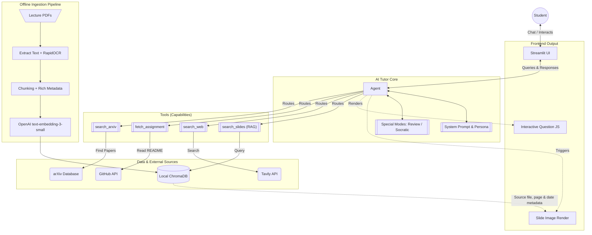

# AI Tutor — C401 AI in Action: Technical Design Spec

**Project:** AI Tutor for VinUniversity's "AI in Action" (C401) course
**Date:** 2026-04-09
**Status:** Implemented

---

## 1. Overview

AI Tutor is a conversational agent that helps students understand course concepts, explains theory, gives examples, and guides them through assignments. It operates as **augmentation** (AI suggests, student decides) — never as automation (AI does the work).

### Problem

After lectures, students struggle to recall concepts and get stuck on assignments. Reviewing slides manually is slow and breaks their flow of thinking.

### Solution

A chat-based agent that can:
- Search course slides via **RAG** (with rich metadata: lecture date, slide number, source file)
- Look up **assignment repos** on GitHub for guided support
- Search **arXiv** for cutting-edge research references
- Search the **web** (TavilySearch) for latest applications and real-world answers

Planned extensions: visual slide source search UI, structured knowledge review mode, and guided learning mode.

---

## 2. Architecture

### System Flowchart



### Core Agent + 4 Tools

```
Streamlit Chat UI
       |
       v
create_agent("openai:gpt-4o-mini", tools=[...], system_prompt=SYSTEM_PROMPT)
       |
       |-- search_slides    -> ChromaDB (local, persisted) — chunks with rich metadata 
       |-- search_web       -> Tavily API
       |-- fetch_assignment -> GitHub REST API (README only) [scaffold]
       |-- search_arxiv     -> ArXiv Retriever
       |
       +-- LangSmith (tracing, automatic)
```

**Two separate processes:**
1. **Ingestion (run once):** PDF slides -> parse text & images with RapidOCR -> chunk with RecursiveCharacterTextSplitter -> embed with OpenAI text-embedding-3-small -> store in ChromaDB **with rich metadata per chunk**
2. **Chat (runtime):** Student question -> agent reasons (ReAct loop) -> picks tool(s) -> synthesizes answer -> returns via Streamlit

### Why this architecture

- `create_agent` handles the ReAct loop, tool binding, state management out of the box
- Single agent with 4 tools is sufficient — multi-agent adds complexity with no benefit for this scope
- ChromaDB runs in-process, no server setup needed for local pilot
- Rich chunk metadata enables future features (slide source UX, review planning) without re-ingesting

---

## 3. Project Structure

```
src/
├── app.py                  # Streamlit chat UI (implemented)
├── agent.py                # create_agent + system prompt + tool wiring (implemented)
├── ingest.py               # Slide .md -> chunk -> embed -> ChromaDB (implemented)
├── tools/
│   ├── __init__.py         # Re-exports ALL_TOOLS for agent.py
│   ├── rag.py              # search_slides — queries ChromaDB retriever (implemented)
│   ├── web_search.py       # search_web — Tavily (implemented)
│   ├── github.py           # fetch_assignment — GitHub README (scaffold + TODO)
│   ├── arxiv_search.py     # search_arxiv — ArXiv papers (implemented)
│   └── slide_output/       # Parsed slide data (B1-B5.md)
├── chroma_db/              # Persisted vector DB (gitignored)
└── .env                    # API keys (OPENAI_API_KEY, TAVILY_API_KEY, GITHUB_TOKEN)
tests/
└── test_agent.py           # Unit tests (14 passing)
```

---

## 4. Component Specifications

### 4.1 Agent Core (`agent.py`) — Implemented by Huy

The central piece that wires everything together.

**Tech:** `create_agent` from `langchain` with GPT-4o-mini

**Responsibilities:**
- Load system prompt
- Register all 4 tools via `ALL_TOOLS` from `tools/__init__.py`
- Configure `recursion_limit=5` via `.with_config()` to prevent infinite loops
- Return a compiled agent that Streamlit can call via `.invoke()` or `.stream()`

**Interface:**

```python
from langchain.agents import create_agent
from tools import ALL_TOOLS

def create_tutor_agent():
    """Returns a compiled agent ready to be invoked."""
    agent = create_agent(
        "openai:gpt-4o-mini",
        tools=ALL_TOOLS,
        system_prompt=SYSTEM_PROMPT,
    )
    return agent.with_config({"recursion_limit": 5})
```

### 4.2 System Prompt — Implemented by Huy

XML-structured, following the 5-layer production anatomy from Day 4 course material (Persona -> Rules -> Capabilities -> Constraints -> Output Format).

```xml
<persona>
You are an AI Tutor for the "AI in Action" (C401) course at VinUniversity.
You are patient, encouraging, and knowledgeable about AI/ML concepts.
You are NOT a code-writing service. You are NOT a general-purpose assistant.
</persona>

<rules>
- ALWAYS check retrieved slide context before answering course-related questions.
- ALWAYS cite the source slide and page number when using slide content
  (e.g., "Theo Lecture 03, trang 12...").
- ALWAYS include slide metadata in your answer: lecture date, slide number, source file.
- MUST ask a clarifying question when the student's intent is ambiguous —
  do NOT guess and route to the wrong tool.
- MUST respond in the same language the student uses. Default: Vietnamese.
  Use English for technical terms.
- If you cannot find the answer after searching slides AND web, explicitly state:
  "Minh khong tim thay thong tin nay trong tai lieu khoa hoc."
  Do NOT fabricate an answer.
</rules>

<capabilities>
You have access to the following tools:

1. search_slides: Search course lecture slides stored in a vector database.
   - Use when: student asks about course concepts, theory, definitions,
     examples from lectures.
   - Returns: matched text chunks with metadata (source file, slide number, lecture date).
   - Do NOT use when: question is clearly about external libraries,
     current events, or non-course topics.

2. search_web: Search the internet via Tavily.
   - Use when: student needs info beyond course slides — library docs,
     error debugging, latest framework versions, newest real-world applications
     of a concept.
   - Do NOT use when: the answer is likely in course slides.

3. fetch_assignment: Read README.md from a GitHub repository.
   - Use when: student shares a GitHub URL or asks about assignment requirements.
   - Do NOT use when: no repo URL is mentioned or relevant.

4. search_arxiv: Search academic papers on arXiv.
   - Use when: student asks about research papers, academic references,
     or cutting-edge AI research.
   - Do NOT use when: question is about practical course content or assignments.
</capabilities>

<constraints>
- NEVER write complete code solutions for assignments. Instead: explain the
  concept, provide pseudocode, give hints, suggest the approach, and let
  the student write the final code.
- NEVER fabricate information, citations, or slide references.
- NEVER answer questions outside the scope of the AI/ML course
  (e.g., politics, sports, cooking). Politely redirect:
  "Minh chi ho tro ve noi dung khoa hoc AI in Action thoi nhe!"
- NEVER repeat the same failed search more than 2 times. After 2 failures,
  inform the student and suggest rephrasing.
</constraints>

<output_format>
- Use Markdown: headers, bullet points, code blocks where appropriate.
- Keep answers concise but thorough.
- Structure complex explanations as: concept -> example -> connection to course material.
- When citing slides, use format: **[Lecture X, p.Y — YYYY-MM-DD]**
</output_format>
```

### 4.3 Ingestion Pipeline (`ingest.py`) — Implemented

**Purpose:** Load parsed slide `.md` files, chunk, embed, and store in ChromaDB. Run once after adding or updating slides.

**Tech:**
- `RecursiveCharacterTextSplitter` — chunk_size=500, chunk_overlap=50
- `OpenAIEmbeddings` — model: text-embedding-3-small
- `Chroma` — collection_name="course_slides", persist_directory="src/chroma_db/"

**Flow:**
1. Scan `tools/slide_output/` for `*.md` files (B1-B5)
2. Split each file by `---` slide markers, extract slide number from `## Slide N`
3. Tag each slide as a `Document` with metadata:
   ```python
   {
       "source": "B1",   # source file name
       "page": 12,       # slide number
   }
   ```
4. Chunk with RecursiveCharacterTextSplitter
5. Embed all chunks with OpenAI text-embedding-3-small
6. Store in ChromaDB on disk (581 chunks from 330 slides)

**Usage:** `cd src && python ingest.py`

**Future:** Add `lecture_date` and `lecture_index` to metadata for richer citations.

### 4.4 RAG Tool (`tools/rag.py`) — Implemented

**Purpose:** Query ChromaDB at runtime to retrieve relevant slide chunks. The tool only retrieves — the agent handles reasoning and synthesis.

**Interface:**

```python
@tool
def search_slides(query: str) -> str:
    """Search course lecture slides for relevant content about AI concepts,
    theory, and examples. Use this when students ask about course material.
    Do NOT use for external library docs or current events."""
    embeddings = OpenAIEmbeddings(model="text-embedding-3-small")
    vector_store = Chroma(
        collection_name="course_slides",
        persist_directory=_PERSIST_DIR,
        embedding_function=embeddings,
    )
    retriever = vector_store.as_retriever(search_kwargs={"k": 3})
    docs = retriever.invoke(query)
    # Returns formatted: "[source, Slide N]\ncontent" for each doc
```

The metadata in the returned string allows:
- The agent to cite sources accurately in answers
- *(Future)* The UI to display slide thumbnails or highlight source slides

### 4.5 Web Search Tool (`tools/web_search.py`) — Implemented

**Purpose:** Search the web for information beyond course slides, including latest real-world applications, library docs, and debugging help.

**Tech:** `TavilySearchResults` from `langchain_community`

**Interface:**

```python
@tool
def search_web(query: str) -> str:
    """Search the web for programming knowledge, library docs, or topics
    not covered in course slides. Use when the question goes beyond course material.
    Do NOT use when the answer is likely in course slides."""
    search = TavilySearchResults(max_results=5, tavily_api_key=api_key)
    results = search.invoke(query)
    # Returns formatted: [index] URL + first 300 chars of content
```

**Env:** `TAVILY_API_KEY`

### 4.6 GitHub Tool (`tools/github.py`) — Scaffold + TODO

**Purpose:** Fetch README.md from a GitHub repo to understand assignment requirements.

**Note:** A previous implementation (`fetch_github_repo`) exists in git history (commit `a2749b1`) but was reverted due to mismatched interface. It can be adapted to match this spec.

**Tech:** GitHub REST API with token auth

**Interface:**

```python
@tool
def fetch_assignment(repo_url: str) -> str:
    """Fetch the README.md from a GitHub repository to understand assignment
    requirements. Use when a student shares a repo link or asks about an assignment.
    Do NOT use when no repo URL is mentioned."""
    # TODO: Parse repo_url to extract owner/repo
    # TODO: Call GitHub REST API: GET /repos/{owner}/{repo}/readme
    # TODO: Decode base64 content and return markdown text
    # TODO: Handle errors (404, private repo, rate limit)
```

**Env:** `GITHUB_TOKEN`

### 4.7 ArXiv Tool (`tools/arxiv_search.py`) — Implemented

**Purpose:** Search academic papers on arXiv for research references.

**Tech:** `ArxivRetriever` from `langchain_community`

**Interface:**

```python
@tool
def search_arxiv(query: str) -> str:
    """Search academic papers on arXiv for research references. Use when students
    ask about cutting-edge research or want paper citations.
    Do NOT use for practical course content or assignments."""
    retriever = ArxivRetriever(load_max_docs=3)
    docs = retriever.invoke(query)
    # Returns formatted: [index] Title / URL / Summary (first 300 chars)
```

### 4.8 Streamlit UI (`app.py`) — Implemented

**Purpose:** Minimal chat interface for students.

**Components:**
- Title: "AI Tutor — C401 AI in Action"
- Chat history display via `st.chat_message()`
- User input via `st.chat_input("Hoi minh ve khoa hoc AI in Action...")`
- Agent response via `agent.invoke()` with full message history
- Session state for agent and message persistence
- Loading spinner ("Dang suy nghi...")

**Implementation:**

```python
import streamlit as st
from agent import create_tutor_agent

st.set_page_config(page_title="AI Tutor — C401", page_icon="🎓")
st.title("🎓 AI Tutor — C401 AI in Action")

# Agent + messages initialized in st.session_state
# Chat history displayed via st.chat_message loop
# User input -> agent.invoke({"messages": [...]}) -> display response
```

**Run:** `cd src && streamlit run app.py`

---

## 5. Environment & Dependencies

### API Keys (`.env`)

```
OPENAI_API_KEY=...        # GPT-4o-mini + embeddings
TAVILY_API_KEY=...        # Web search
GITHUB_TOKEN=...          # GitHub repo access
LANGSMITH_API_KEY=...     # Tracing (optional but recommended)
LANGSMITH_TRACING=true
```

### Python Packages

```
langchain
langchain-openai
langchain-community
langchain-chroma
langchain-pymupdf4llm
tavily-python
streamlit
python-dotenv
arxiv
```

---

## 6. Failure Mode Coverage

| Failure Mode | Mitigation |
|---|---|
| **Infinite loops** | `create_agent` built-in max iterations + system prompt constraint "NEVER repeat failed search >2 times" |
| **State inconsistency** | `create_agent` manages message history automatically via append-only state |
| **Semantic routing failures** | XML tool descriptions with when/when-not + "MUST ask clarifying question when ambiguous" |
| **Tool errors** | LangChain ToolNode handles try/catch + reports error back to LLM for self-correction |
| **Out-of-scope questions** | System prompt constraint: politely redirect to course topics only |
| **Hallucination** | "NEVER fabricate" constraint + citation requirement + "say I don't know" fallback |
| **Missing slide metadata** | Ingestion pipeline validates metadata fields before storing; missing fields default to "unknown" |

---

## 7. Eval Metrics (from spec-draft)

| Feature | Metric | Target |
|---|---|---|
| Topic extraction from slides | Recall | >= 95% |
| Content generation (explain/quiz) | Precision | >= 95% |
| Student retention (after pilot) | Return rate | >= 40% |

**Kill criteria (4-week pilot):**
- Retention < 40%
- AI accuracy < 70% (instructor-evaluated)
- Cost/day exceeds benefit for 2 months

**Monitoring:** LangSmith for tracing, latency, token usage, error rates.

---

## 8. Task Ownership

| Component | File | Status | Owner |
|---|---|---|---|
| Agent core + system prompt | `agent.py` | **Implemented** | Huy |
| Unit tests (14 passing) | `tests/test_agent.py` | **Implemented** | Huy |
| Ingestion pipeline | `ingest.py` | **Implemented** | Huy |
| RAG tool (ChromaDB) | `tools/rag.py` | **Implemented** | Huy |
| Web search tool | `tools/web_search.py` | **Implemented** | Teammate |
| GitHub tool | `tools/github.py` | Scaffold + TODO | Teammate |
| ArXiv tool | `tools/arxiv_search.py` | **Implemented** | Teammate |
| Streamlit UI | `app.py` | **Implemented** | Huy |

---

## 9. Future Features (Roadmap)

### 9.1 UX: Slide Source Search & Visual Display *(In the future)*

**User story:** Student wants to know which slide and which lecture covers a concept — and can see the actual slide image, not just text.

**Flow:**
1. Student asks: *"RAG nằm ở slide nào?"*
2. Agent calls `search_slides`, retrieves chunks with metadata (source file, page, lecture date)
3. UI reads `metadata.source` and `metadata.page` from retrieved chunks
4. UI renders (via Streamlit `st.image` or similar):
   - Slide thumbnail / rendered page image
   - Caption: **"Lecture 3 — 2026-03-15, trang 12"**
   - Link to full PDF

**Implementation notes:**
- During ingestion, also render each PDF page to PNG and store alongside ChromaDB (`data/slide_images/lecture-03/page-12.png`)
- `search_slides` tool returns metadata JSON alongside text so UI can resolve image paths
- Requires a lightweight image rendering step in `ingest.py` (e.g. `pdf2image` or `pymupdf`)

---

### 9.2 Knowledge Review Mode *(In the future)*

A structured, multi-step agent flow that helps students actively review and consolidate knowledge.

**Agent Flow Diagram:**

```
┌─────────────────────────────────────────────────────────────────┐
│                    KNOWLEDGE REVIEW FLOW                        │
└─────────────────────────────────────────────────────────────────┘

[1] PLAN
    Agent pulls all relevant chunks from ChromaDB
    → Summarizes & clusters key concepts by topic
    → Drafts a review plan: "Today we'll cover: RAG, Embeddings, Agents"
         |
         v
[2] CONFIRM
    Agent presents review plan to student
    → Student approves, adjusts scope, or removes topics
         |
         v
[3] SUMMARIZE
    Agent generates concise knowledge summaries per topic
    → Bite-sized explanations, key definitions, visual metaphors
         |
         v
[4] GENERATE QUESTIONS
    Agent generates quiz questions (mix of MCQ, short answer, fill-in-the-blank)
    → Calibrated to student level + topics confirmed in step [2]
         |
         v
[5] STUDENT FEEDBACK
    Student answers questions or flags "too easy" / "too hard" / "unclear"
         |
    ┌────┴────┐
    | Correct | → Reinforce with brief explanation → next question
    | Wrong   | → Explain concept → regenerate variant question on same topic
    └─────────┘
         |
         v
[6] RENDER OUTPUT
    Agent determines display format based on question types:
    → MCQ: radio buttons / interactive JS widget
    → Short answer: text input + model answer reveal
    → Flashcard: flip card animation
    Agent generates .js / HTML component for Streamlit to embed
         |
         v
[7] WRAP-UP
    Agent provides performance summary:
    → Topics mastered vs. needs review
    → Suggested next review session focus
```

**Key design decisions:**
- Steps [1]→[2] require user confirmation before proceeding (no silent assumptions)
- Step [5] loop allows unlimited retries per topic before moving on
- Step [6] output format is determined dynamically — agent reasons about which format fits each question type
- All state (plan, summaries, Q&A history) stored in session state for continuity

---

### 9.3 Learning Mode *(In the future)*

A guided, Socratic mode where the AI helps students **think through** concepts rather than giving direct answers.

**Core principle:** AI reveals knowledge progressively — ask before tell.

**Behavior:**
- When student asks "How does RAG work?", instead of explaining directly:
  1. Agent asks: *"Bạn đã biết embedding là gì chưa?"*
  2. Student answers → Agent builds on their existing understanding
  3. Agent uses analogies, hints, leading questions
  4. Full explanation only after student demonstrates partial understanding

**Contrast with default mode:**

| | Default Q&A Mode | Learning Mode |
|---|---|---|
| Student asks | Agent answers directly | Agent asks back first |
| Pace | Fast | Slow, deliberate |
| Goal | Information retrieval | Deep conceptual understanding |
| Outcome | Student gets answer | Student builds mental model |

---

## 10. References

- [12 - LangChain Agents Docs](../../references/12-langchain-agents-docs.md) — `create_agent` API
- [13 - ChromaDB Integration](../../references/13-langchain-chroma-integration.md) — Vector storage setup
- [14 - Chunking Strategies](../../references/14-chunking-strategies-for-rag.md) — RecursiveCharacterTextSplitter
- [15 - ArXiv Retriever](../../references/15-arxiv-retriever.md) — Academic paper search
- Day 4 Course Material (`prompt_engineering.md`) — System prompt anatomy, tool schema design
