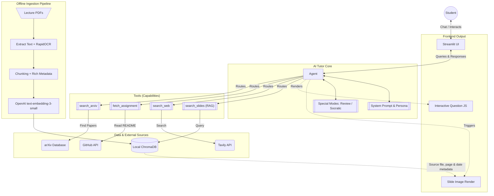
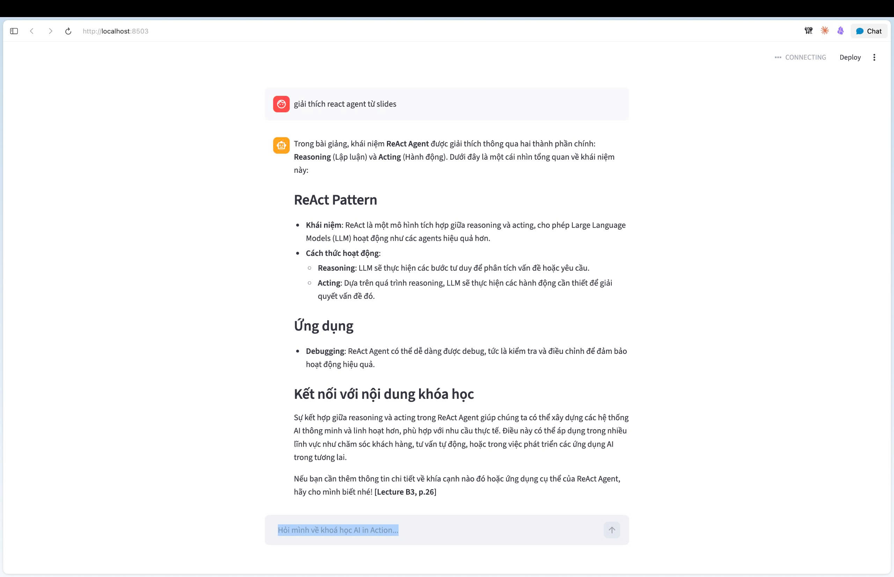
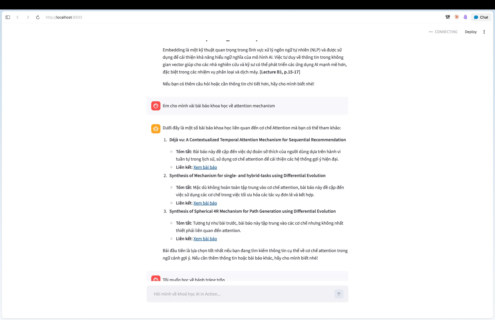

# AI Product Canvas & Technical Specification

**Project:** AI Tutor cho học viên khoá học được thiết kế sẵn (cụ thể: khoá AI in Action)
**Date:** 2026-04-09
**Status:** Approved

---
## 1. Canvas
|   | Value | Trust | Feasibility |
|---|-------|-------|-------------| 
| **Câu hỏi guide** | User nào? Pain gì? AI giải quyết gì mà cách hiện tại không giải được? | 1. Khi AI sai thì user bị ảnh hưởng thế nào? User biết AI sai bằng cách nào? User sửa bằng cách nào?   2. Khi AI đúng thì user được lợi gì?   3. Khi AI không chắc chắn thì sao?   4. Khi user không hài lòng, mất niềm tin thì sao? | Cost bao nhiêu/request? Latency bao lâu? Risk chính là gì? |
| **Trả lời** | *Học viên sau khi nghe giải thích lý thuyết xong, chưa hiểu rõ hay buổi chiều làm assignment gặp khó khăn, bắt buộc phải xem lại slide để đọc lại kiến thức.     AI có thể trả lời câu hỏi của học viên, giải thích lại kiến thức, đưa ra ví dụ, gợi ý bài tập tương tự.* | *1. Khi AI trả lời sai → user có thể làm sai yêu cầu từ assignment, hoặc không hiểu đúng kiến thức. User biết AI sai khi đọc lại slide và thấy khác biệt, hoặc khi làm sai và bị báo lỗi. User sửa bằng cách hỏi lại AI hoặc xem lại slide, báo lỗi trực tiếp cho AI để replan và kiểm tra lại kiến thức.*   *2. Khi AI đúng → user được lợi khi có thể trả lời câu hỏi của mình nhanh chóng, không cần xem lại slide, có thể hiểu rõ hơn kiến thức, có thể làm bài tập tốt hơn.*   *3. Khi AI không chắc chắn → AI có thể trả lời không , AI sẽ biết mình không chắc chắn và có thể hỏi lại user hoặc xem lại slide.*   *4. Khi user không hài lòng, mất niềm tin → có đánh giá sau khi user trả lời xong, nếu user không hài lòng thì AI sẽ replan và kiểm tra lại kiến thức, ghi lại log để cải thiện.* | **cost:** ~$0.001/request     **latency**: <1s     **risk**: quá context window nếu xử lí tài liệu không tốt, search engine tìm thấy thông tin quá dài* |

---

## Automation hay augmentation?

**Justify:**

*Augmentation — AI gợi ý, hỏi lại xác nhận với user, user quyết định cuối cùng.*
AI Tutor hoạt động dưới hình thức Augmentation: trợ giúp học viên hiểu bài, đưa ra gợi ý, trích xuất slide có metadata minh bạch minh hoạ cho kiến thức. Chế độ Socratic Learning sẽ hỏi lại học sinh để khơi gợi tư duy chứ không giải hộ bài (Không bao giờ automation việc viết toàn bộ code).

*Automation — quá trình tìm kiếm thông tin từ tài liệu, slide, search engine.*
Chỉ automation ở khía cạnh tiền xử lý tài liệu (PDF parsing với RapidOCR, chunking) và hệ thống tra cứu RAG / Web Search thay vì sinh viên duyệt thủ công.

---

## Learning signal

| # | Câu hỏi | Trả lời |
|---|---------|---------|
| 1 | User correction đi vào đâu? | *Mỗi lần user feedback thông tin bị sai → ghi log (thông qua LangSmith) → dùng để cải thiện model* |
| 2 | Product thu signal gì để biết tốt lên hay tệ đi? | *Đếm log số lần mà user feedback thông tin bị sai, số lần user sửa output, số lần user không hài lòng với output* |
| 3 | Data thuộc loại nào? | *Domain-specific — model trả lời dựa trên tài liệu của khoá học (Slide metadata phong phú)* |

**Có marginal value không?** 
Model có thể biết kiến thức này nhưng chưa chắc đã tuân theo format hay yêu cầu của assignment, chưa biết rõ khoá học có kiến thức chi tiết nào. 

**Ai khác cũng thu được data này không?**
Không vì dựa trên tài liệu nội bộ của khoá học, không public.

---

## 2. Architecture & Component Specifications (Mới bổ sung)

### System Flowchart

### Cấu trúc dự án
Tích hợp LangChain `create_agent` thay vì tự triển khai đồ thị thủ công (để quản lý Tool Node và ReAct loop tự động).
- `agent.py`: Khởi tạo Agent (GPT-5-mini) + System Prompt
- `ingest.py`: PDF -> chunk (RecursiveCharacterTextSplitter) -> embed -> ChromaDB
- `tools/rag.py`: RAG search với rich metadata gán sẵn.
- `tools/web_search.py`, `tools/github.py`, `tools/arxiv_search.py`: Các tool ngoại vi được gán cho Agent.

---

## 3. Use Case Paths (Happy / Low-confidence / Failure / Correction)

### 3.1 Happy Path

#### Scenario
Sinh viên đặt câu hỏi rõ ràng và cung cấp đầy đủ tài liệu liên quan (PDF bài giảng, context cụ thể).

#### Flow
1. Nhận input (câu hỏi + tài liệu)
2. Xác định intent:
   - Học lý thuyết
   - Yêu cầu ví dụ thực tế
   - Tìm tài liệu chính thống
3. Trích xuất thông tin qua `search_slides` (ChromaDB với metadata).
4. Kết hợp với kiến thức bên ngoài (gọi `search_web` qua Tavily, `fetch_assignment` qua GitHub, hoặc `search_arxiv` tuỳ context).
5. Sinh câu trả lời hoàn chỉnh.

#### Output
- Tóm tắt nội dung từ tài liệu khóa học.
- Trích dẫn slide metadata: "[Lecture X, p.Y — YYYY-MM-DD | Tên File]".
- Hình ảnh thumbnail slide trực quan hiển thị trên UI.
- Gợi ý bài tập, concept giải thích theo Markdown format.

#### Key Characteristics
- Độ chính xác cực cao, có source rõ ràng.
- Giao diện UI đa phương tiện.

---

### 3.2 Low-Confidence Path

#### Scenario
- Tài liệu không chứa đủ thông tin, từ khóa học không có trong metadata.
- Câu hỏi mơ hồ hoặc quá rộng.

#### Flow
1. Phát hiện độ tự tin thấp: DB không match chunk nào, tool thất bại.
2. Quyết định chiến lược:
   - Đặt lại câu hỏi làm rõ (Clarifying Questions) từ Agent.
   - Trả lời ở mức tổng quan và khuyên dùng Web search.

#### Output
- Thông báo thiếu thông tin nội bộ.
- Câu hỏi làm rõ.

#### Key Characteristics
- KHÔNG đoán bừa (Zero hallucination). Minh bạch giới hạn.

---

### 3.3 Failure Path

#### Scenario
- Không đọc được file PDF hoặc đứt API GitHub, Tavily.

#### Flow
1. Phát hiện lỗi qua ToolNode.
2. Catch Try/catch, Agent không bị sập đồ thị.
3. Trả về thông báo fallback tự động và yêu cầu diễn đạt lại câu hỏi (Dừng sau n limit iterations).

#### Output
- Cảnh báo gián đoạn dịch vụ liên kết rõ ràng.
- Hướng dẫn nhập lại hoặc xử lý lại.

#### Key Characteristics
- Fail an toàn (Safe Failure). Không treo UI.

---

### 3.4 Correction Path

#### Scenario
Người dùng phản hồi AI trả lời sai ngữ cảnh, do fetch file sai.

#### Flow
1. Agent nhận chuỗi feedback (Append-only messages).
2. Tự động chuyển mode reasoning tìm tool khác hoặc query khác.
3. Sinh câu trả lời mới và thừa nhận lỗi sai.

#### Output
- Xin lỗi và đính chính.
- Bổ sung repo GitHub README thực tế thay vì RAG.

#### Key Characteristics
- ReAct Agent tự sửa logic (Self-correction).

---

### 3.5 Knowledge Review Path & Socratic Path (Luồng tương lai)

#### Scenario
Sinh viên muốn ôn thi (Review) hoặc muốn giải hộ bài (Socratic).

#### Flow
1. [PLAN] Lên kế hoạch chủ đề. [CONFIRM] Xin học viên xác nhận độ khó.
2. Hỏi ngược (Socratic questioning) để khơi gợi cách giải thay vì xuất đáp án.
3. Xác nhận bằng Mini-quiz (Sinh UI động trên Streamlit).

#### Output
- Giao diện tương tác Flashcard/Quiz thay vì Chat Text thông thường. Gợi ý tư duy.

---

## 4. Eval metrics

AI tutor hiện có hai tính năng cốt lõi. Với mỗi tính năng, ta cần định nghĩa cụ thể "Báo Nhầm" (False Positive) và "Bỏ Sót" (False Negative) nghĩa là gì.

### Tính năng A: Trích xuất chủ đề từ slide

AI quét slide và quyết định: "Đây là một chủ đề" hoặc "Đây không phải chủ đề."

| | AI nói "Đây LÀ chủ đề" | AI nói "Đây KHÔNG phải chủ đề" |
|---|---|---|
| **Thực sự là chủ đề** | ✅ Đúng (TP) | ❌ **Bỏ Sót (FN)** — sinh viên không thấy chủ đề này, không thể học |
| **Không phải chủ đề** | ❌ **Báo Nhầm (FP)** — sinh viên thấy một chủ đề giả/không liên quan trong danh sách | ✅ Đúng (TN) |

**Quyết định: Ưu tiên RECALL cho Trích xuất Chủ đề.** Thêm vài chủ đề giả thì chấp nhận được. Bỏ sót chủ đề thật nghĩa là sinh viên có lỗ hổng kiến thức.
- **Recall ≥ 95%**
- **Precision ≥ 75%**

---

### Tính năng B: Hành động trên chủ đề (Giải thích / Đơn giản hóa / Thiết kế Quiz)

| | AI hiển thị output | AI giấu/cảnh báo output |
|---|---|---|
| **Output đúng & hữu ích** | ✅ Đúng (TP) | ❌ **Bỏ Sót (FN)** — sinh viên không nhận được giải thích hữu ích |
| **Output sai hoặc gây hiểu nhầm** | ❌ **Báo Nhầm (FP)** — sinh viên học thứ SAI | ✅ Đúng (TN) |

**Quyết định: Ưu tiên PRECISION cho Hành động trên Chủ đề.** Dạy sai kiến thức là cực kỳ nguy hiểm.
- **Precision ≥ 95%**
- **Recall ≥ 80%**

### Áp dụng vào các tính năng con:

| Tính năng con | User thấy lỗi không? | Chi phí lỗi | Ưu tiên |
|---|---|---|---|
| **Trích xuất chủ đề** | Có | Bỏ sót = mất giá trị (FN) | **RECALL** |
| **Đơn giản hóa / Quiz** | Một phần | Kiến thức sai lệch = học hiểu sai (FP) | **PRECISION** |

---

## 5. Failure Modes (Base trên kiến trúc Agent & Tool)

Bốn lỗi cốt lõi đã được ánh xạ trực tiếp với kiến trúc mô hình Agent cụ thể:

### 5.1. Vòng lặp vô tận (Infinite Loops)
- **Trigger:** RAG không tìm được kết quả, Agent "cố chấp" sinh query và tìm đi tìm lại.
- **Hệ quả:** Tốn Token Rate Limit, bị treo (RecursionLimitReached).
- **Mitigation:** Đặt Max Iterations (VD: 5) trong LangChain `create_agent` và System prompt Constraint "NEVER repeat failed search > 2 times".

### 5.2. State Inconsistency & History Loss
- **Trigger:** Chuyển đổi giữa các task/Tool song song bị mất context.
- **Hệ quả:** AI Tutor "quên" đoạn trên vừa nói gì (Amnesia). 
- **Mitigation:** Dùng cơ chế Append-only message history của thiết kế có sẵn, không overwrite state trong memory.

### 5.3. Semantic Routing Failures (Điều phối Tool nhầm)
- **Trigger:** Học sinh bảo "Em muốn hiểu phần trên" -> Agent gọi Web Search thay vì RAG vì hiểu lầm Intent.
- **Hệ quả:** Tìm sai nguồn gốc, trải nghiệm tồi.
- **Mitigation:** Trong Prompt định nghĩa rõ ràng Capabilities của 4 Tools theo chuẩn XML: `<capabilities>` Use when/Do NOT Use when. MUST as clarifying question.

### 5.4. Tool Error (Lỗi khi gọi tool)
- **Trigger:** File PDF parse lỗi, GitHub Repo Private, Tavily Timeout.
- **Hệ quả:** Sập Agent, UI trắng màn hình.
- **Mitigation:** Node gọi tool phải bọc trọn vẹn trong block Try/Catch. Báo lại cho Reasoning model lỗi string text để LLM tự nghĩ cách reply an toàn.

---

## 6. ROI 3 KỊCH BẢN

|   | Conservative | Realistic | Optimistic |
|---|-------------|-----------|------------|
| **Assumption** | 80 sinh viên dùng thử, 40% engage thường xuyên. Chỉ pilot 1–2 môn, nội dung hạn chế. | 400 sinh viên active, 65% engage thường xuyên. Triển khai 5–6 môn, TA giảm tải rõ rệt. | 1.500 sinh viên active (~40% VinUni), 80% engage thường xuyên. Triển khai toàn trường + license cho trường đối tác (Year 2+). |
| **Cost** | 80 SV × 20 phút tiết kiệm = 26.7 giờ/ngày → ~$214 | 400 SV × 25 phút = 167 giờ/ngày → ~$1.336 + TA giảm 2h/ngày ($20/h) = ~$40 → Tổng ~$1.376| 1.500 SV × 30 phút = 750 giờ/ngày → ~$6.000 + doanh thu license → Tổng ~$6.450 |
| **Benefit** | Mỗi user tiết kiệm 15 phút/ngày → 12.5 giờ/ngày tổng | 58 giờ/ngày | 425 giờ/ngày |
| **Net** | +$184 | +$1.226 | +$6.000 |

**Kill criteria (Dừng dự án nếu sau 4 tuần pilot):**
- Tỷ lệ sinh viên quay lại dùng lần 2 < 40% (low retention).
- Độ chính xác AI < 70% (đánh giá giảng viên).
- Cost vượt Benefit 2 tháng liên tục.

---

## 7. Mini AI Spec — AI Tutor cho khóa AI in Action

| VALUE | TRUST | FEASIBILITY |
|---|---|---|
| **User:** Sinh viên khóa C401 — AI in Action | **Precision cao** cho bài giảng/quiz | **Cost:** ~$0.008/request |
| **Pain:** Cần người giải đáp ngay nội dung Slide | **Recall cao** cho trích xuất chủ đề | **Latency:** <1s |
| **Aug:** AI khuyên giải, user quyết định code | **Khi sai →** Thừa nhận và tìm cách khác | **Risk:** Content context window limit |
| **Auto:** Pipeline ingest Data & web search | **Recovery:** Ghi log LangSmith để sửa | **Dep:** Langchain Agent, OpenAI API |

### Chi tiết kỹ thuật
| Hạng mục | Chi tiết |
|---|---|
| Kiến trúc | LangChain ReAct Agent (GPT-5-mini) kết hợp 4 Agent Tools. |
| Nguồn dữ liệu | PDF Slide khóa nội bộ (gắn Chunking Metadata), Web/github external. |
| Tính năng chính | Tra cứu nội khoá (RAG), Nghiên cứu mở rộng, Quiz, Socratic Mode. |

### Ràng buộc & Giới hạn
1. Không bao giờ viết nguyên đáp án Code.
2. Trích xuất tài liệu bắt buộc kèm trích dẫn (Lecture Name, File, Date). Dùng thư viện Tool chính xác (capabilities parsing).
3. Structured Output (Pydantic) hỗ trợ định tuyến Intent.
4. Quá 2 lần tool failure phải khai báo minh bạch cho user qua Fallback Escalation.

---

## 8. Phân công (Task Ownership & Phụ trách cấu thành)
- Canvas - Công
- 4 paths - Mong
- Eval metrics - Thắng
- top 3 failure modes - Toàn + Hoàng
- ROI 3 kịch bản - Minh
- Mini AI spec 1 trang - Huy

---
# Demo

   